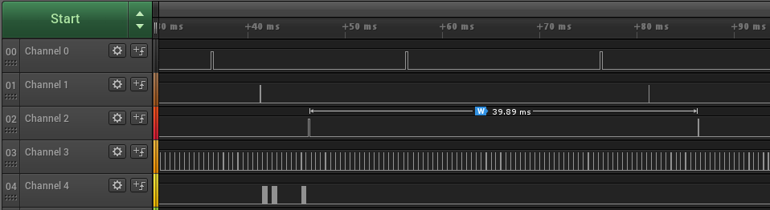
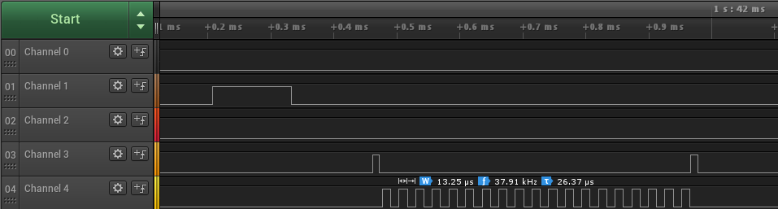

CSC 460/560: Design and Analysis of Real-Time Systems
=====================================================

Project 1 - Phase1
==================

Authors: Darren Prince and Jakob Leben

Code: https://github.com/the-lords-of-the-roombas/laser-tag

Overview
********

Here is a high-level overview of the requirements of this project, as well
as our extensions:

Requirements:
  - Joystick controls arm of servo motor to aim attached
    infra-red (IR) emitter (LED) towards target.
  - Joystick button triggers transmission of a byte of information (code)
    towards target, in form of modulation of IR emission.
  - There are 4 different targets - IR receivers: each requires reception of
    a different code to count as a hit. The system must be able to hit all 4.
  - Software uses time-triggered architecture.

Extensions:
  - Joystick allows selection of one of a predefined set of codes to
    be emitted.
  - A set of LED lights indicates index of selected code in binary form.

Components
**********

The following hardware components were used in the project:

- Arduino Mega 2560 (http://www.arduino.cc/)
- Joystick
- Servo motor
- Infra-red emitter (IR LED)
- Two status-indicator LEDs
- 5V power supply

Reading joystick data
---------------------

The joystick is the main piece of hardware controlling the system. It provides
voltage signals modulated by its tilt along two axes independently, as well as
a current switch operated by a downward push of the joystick. The tilt along
one axis is used to control the motion of the servo motor, while the tilt
along another axis is used for selection of a code to be transmitted. The
switch acts as a trigger to begin the transmission of data over IR.

Hardware
........

The joystick has 5 pins, connected to the system as follows:

- +5V -> power supply
- GND -> system ground
- X (voltage modulated by x-axis tilt) -> Arduino analog input 0
- Y (voltage modulated by y-axis tils) -> Arduino analog input 1
- SW (current switched by downward push) -> Arduino digital pin 8

We placed a resistor in series between the joystick +5V pin and the power supply
to act as a pull-up resistor such that operation of the switch results in a solid
distinction between 0V and 5V on the SW pin.

Software
........

The software polls the Arduino analog input 0 every 20 ms to sample
the joystick x-axis tilt. At every sampling, the information is immediately
applied to control the motion of the servo motor, as described in a section
below.

The Arduino analog input 1 is polled every 40 ms to sample the
joystick y-axis tilt. This is used for selection of data to be transmitted
on joystick push, as described in a section below.

The state of the joystick switch was sampled by reading the Arduino digital
pin 8. The digital pins can act as inputs or outputs, so the pin is
explicitly placed into the input mode at system startup. Upon activation of the
switch (pushing of the joystick), the software begins transmission of the
data code over IR, as explained in detail in a section below.
The switch input is sampled every 40 ms.

The difference in sampling periods of the different inputs is supported
by the time-sensitivity of the tasks. The servo motor control code occurs
every 20 ms to allow smooth movement of the motor.

Controlling servo
-----------------

Hardware
........

The servo motor has 3 pins, connected to the system as follows:

- +5V -> power supply
- GND -> system ground
- S (pulse-width control signal) -> Arduino digital pin 9.

Software
........

The servo motor is controlled in the following way: the amount of
joystick tilt along the x-axis controls the direction and speed of rotation
of the motor arm; central position means no movement, joystick displacement in
one direction controls speed of rotation in one direction, and conversely
displacement in the opposite direction.
This allows easier control of the motor than
applying the tilt directly to the angle of the motor arm.

The Arduino "Servo" library is used to produce servo control signal on
Arduino digital pin 9. Using the stock Servo library conflicts with
custom use of the Arduino chip's timers for transmission of data over IR.
This was solved by modifying the library, as explained in the section on
IR data transmission below.

Arduino analog pin 0 is polled every 20 ms to obtain the control value.
Although the full range of the input is translated by Arduino library to
numerical value in the range of 0 to 1024, the range of our input is
reduced to 380 due to the pull-up resistor required for operation of the
joystick switch. Moreover, we found two issues with the quality of the input:

1. The input is unsteady, there is noticeable noise present (fluctuation
   within about 2% of the total signal range)
2. The relation between joystick tilt and the system input is highly non-linear.

These issues are indicators of poor quality of the joystick and perhaps
also Arduino's analog input.

The first issue could cause the motor to move even when joystick is not
touched. This is solved by disregarding the input fluctuation around the
central point. After scaling the input to a range of -100 to 100
(such that 0 corresponds to central joystick position),
we translated all values between -10 and 10 to a constant 0 and performed
no control action. Moreover, the signal is passed through a first-order
low-pass IIR filter for smoothing (also implemented by the same authors)::

  void joystick_read_position_and_control_servo(void*object)
  {
      joystick_state* jstick = (joystick_state*)object;

      // Lo-pass filter the input
      int in_raw = analogRead(x_pin);
      int in = filter_process(&jstick->filter, in_raw);

      // Map input to range -100 to 100
      int step = map(in, 0, 380, -100, 100);

      // Don't do anything if inside the range -10 to 10
      if (step >= 10)
          step -= 10;
      else if (step <= -10)
          step += 10;
      else
          return;

      // ...
  }

The second issue (non-linear control-to-signal relation) is not yet
addressed in our solution, but it was found to not cause much trouble
in this application.

Finally, the value of the input is added to a state variable persistent
across input samplings which represents the desired motor arm angle. This
value is converted to a number of degrees between 0 and 180, and sent to
the motor control output on Arduino digital pin 9, with the help of the
Arduino "Servo" library::

  void joystick_read_position_and_control_servo(void*object)
  {
      // ...

      // Update control variable and keep it in range 0 to 3000
      int servo_ctl = jstick->servo_control + step;
      int range = 3000;
      if(servo_ctl < 0) servo_ctl = 0;
      if(servo_ctl > range) servo_ctl = range;
      jstick->servo_control = servo_ctl;

      // Map control variable to servo degrees and output that to servo
      int servo_degrees = map(servo_ctl, 0, range, 0, 180);
      servo.write(servo_degrees);
  }

Selecting transmission code
---------------------------

The goal of adding a method for selecting which code was to be transmitted was to
avoid having to hard-code a transmission code and change this hard coding whenever
we require transmission to a different receiver that expects a different code.

The currently selected code is indicated by two LED lights, each representing
a bit of information (light on = 1, light off = 0), and thus being able to
indicate one of the 4 distinct codes.

The interaction is designed so that tilting the joystick along the y axis
all the way out of the central position causes selection of the next code
in the sequence. Repeating the action requires return of the joystick back
to the central position. Repeated action cycles across the available codes,
and direction of joystick tilt determines direction of cycling.

Hardware
........

The two LEDs are connected to the system ground, and to Arduino digital pins 2
and 3.

Software
........

The Arduino analog input 1 is polled every 40 ms to receive the joystick y-axis
tilt, which is provided by the Arduino library as a numerical value in
the range of 0 to 380 (reduced range as explained above). If the input
value is in the lower quarter of the range, it is mapped to -1, the upper
quarter is mapped to 1, and the rest to 0. This value is compared
to its equivalent computed at the previous sampling to detect change.
If the change is from 0 to -1 or from 0 to 1, then the value is added to
the current selected code index. The index is wrapped to the range 0 to 3
to correpond to the 4 available distinct codes::

    void joystick_update_code_selection(void *object)
    {
      joystick_state* jstick = (joystick_state*)object;

      int y = analogRead(y_pin);
      int joystick_state;
      if (y < 90)
        joystick_state = -1;
      else if(y > 270)
        joystick_state = 1;
      else
        joystick_state = 0;

      if (joystick_state != jstick->previous_joystick_y_state && joystick_state)
      {
        int code_idx = jstick->code_idx + joystick_state;
        if (code_idx >= 4)
          code_idx = 0;
        else if(code_idx < 0)
          code_idx = 3;
        jstick->code_idx = code_idx;
      }

      jstick->previous_joystick_y_state = joystick_state;
    }

The two indicator LEDs are then controlled by setting the pins 2 and 3 to
the value of each of 2 bits representing the code index, respectively::

    void update_current_code(void*)
    {
        int old_code_idx = joystick_code_index(&joystick);
        joystick_update_code_selection(&joystick);
        int code_idx = joystick_code_index(&joystick);
        // ...
        int code_low_bit = (code_idx >> 0) & 0x1;
        int code_hi_bit = (code_idx >> 1) & 0x1;
        digitalWrite(code_indicator_lo_pin, code_low_bit ? HIGH : LOW);
        digitalWrite(code_indicator_hi_pin, code_hi_bit ? HIGH : LOW);
    }

Emitting code over IR
---------------------

The requirement was to transmit 1 byte of information encoded as modulation
of IR emission:

- A bit of transmission is represented as the binary choice between:
    - Oscillation between full and zero emission amplitude at 38kHz (value 1)
    - Constant zero emission amplitude (value 0).
- The length of each bit is 500 microseconds, meaning that emission should
  stay in a state corresponding to the value of any bit for 500 microseconds
  and then change to the state corresponding to the next bit.
- Before a byte is transmitted, a transition from 1 to 0 and a full-length 0
  bit must be observed by the receiver.

Hardware
........

We decided to use the capability of the ATmega2560 chip to generate a PWM
waveform for the 38kHz modulation of IR emission which corresponds to the bit
value of 1. A PWM signal with 50% pulse width was used for the value 1. We
first tried to use the 0% pulse width for the value 0, but this did not
result in constant LOW output, but still produced short HIGH spikes. We
solved this by rather disabling the PWM output altogether to generate the
value 0.

We used the Arduino digital pin 13 for PWM output. The positive
pin of the IR LED was thus connected to this pin, in addition to connecting
the ground pins of the two devices. Moreover, the amount of current drawn
from the Arduino was limited with a resistor.

Software
........

The Arduino digital pin 8 is polled every 40 ms to obtain the value of
the joystick switch. This is simply provided by the Arduino library
as a boolean true or false value. The swich in combination with the pull-up
resistors operates so that joystick press results in a digital LOW
(boolean false), while the natural state is digital HIGH (boolean true).
This value is compared by its state at the previous input sampling,
and if it changes from HIGH to LOW (the joystick is pressed), then the
code transmission is initiated::

    void joystick_read_pressed(void *object)
    {
        joystick_state* jstick = (joystick_state*)object;
        jstick->is_pressed = !digitalRead(sw_pin);
    }

    void detect_joystick_press_and_shoot(void*)
    {
        bool was_pressed = joystick_is_pressed(&joystick);
        joystick_read_pressed(&joystick);
        bool is_pressed = joystick_is_pressed(&joystick);

        if (!was_pressed && is_pressed)
        {
            int code_idx = joystick_code_index(&joystick);
            char code = codes[code_idx];
            gun_trigger(&gun, code);
        }
    }

A challenge arises in implementation of code transmission:
the Arduino library only allows PWM generation at
a fixed frequency, which is not our desired frequency of 38kHz.
Therefore, we used the AVR C library to precisely configure a chip's
hardware timer and its PWM waveform generation by explicitely setting
the related registers.

Another issue is that the Arduino Servo library uses all the chip's timers
in order to support controlling a large number of Servo motors by the same
Arduino chip. This is heavily redundant as we are only controlling a single
motor. We have solved this by modifying the Servo library and disabling its
use of the timer that we used for our purpose. Luckily, the Servo library
allows a very convenient way to do this by simply removing a
pre-processor definition. In particular, we have commented out the line 62
in the library's header file to disable use of timer number 1 of which
waveform-generation output is connceted to Arduino's digital pin 13.
Disabling the timer 1 in the Servo library is okay,
because the first created instance of the Servo class will use the timer
number 5, and we only need one instance::

    #if defined(__AVR_ATmega1280__) || defined(__AVR_ATmega2560__)
    #define _useTimer5
    //#define _useTimer1
    #define _useTimer3
    #define _useTimer4

In order to generate a 38kHz PWM signal we need to make the timer counter reset
every 1/38000 seconds, which is about 26.316 microseconds.
With our chip's 16MHz clock speed and no clock pre-scaling that corresponds
to about 421 clock cycles. The chip's 16 bit counter register can hold this
value, so no counter overflow is involved.

In the timer's Fast PWM mode, the
counter will reset when reaching the value in the Output-Compare Register A,
which was set to 412. We generated a 50% PWM signal using the
Waveform Generator C, by setting the  Output-Compare Register C to 210.

The timer 1 was configured with the following code::

    #define GUN_TIMER_TOP 421
    #define GUN_TIMER_HALF 210

    void gun_init(gun_state * gun)
    {
        // ...

        // Clear control registers
        TCCR1A = 0;
        TCCR1B = 0;

        // Disable interrupt from Output-Compare C
        TIMSK1 &= ~(1<<OCIE1C);

        // Select Fast PWM mode (15)
        TCCR1A |= (1<<WGM10) | (1<<WGM11);
        TCCR1B |= (1<<WGM12) | (1<<WGM13);

        // Use clock with no prescaler
        TCCR1B |= (1<<CS10);

        // Set counter TOP value by setting Output-Compare Register A
        OCR1A = GUN_TIMER_TOP;

        // Set Waveform Generator C to 50% pulse width
        // by setting Output-Compare Register C
        OCR1C = GUN_TIMER_HALF;

        // ...
    }

Arduino has the output of the Waveform Generator C of Timer 1 connected to
its digital pin 13, which was set to output mode::

    void gun_init(gun_state * gun)
    {
        //  ...
        pinMode(13, OUTPUT);
        //  ...
    }

In order to generate the bit values according to our IR communcation protocol,
we enabled the Waveform Generator C output for 500 microseconds for the value 1,
and disabled it for the value 0::

    static void gun_send_hi()
    {
        // Enable output C:
        TCCR1A |= (1<<COM1C1);
    }

    static void gun_send_lo()
    {
        // Disable output C:
        TCCR1A &= ~(1<<COM1C1);
    }

Transmission of a byte was performed by a periodic task which transmits one
bit every period (500 microseconds). The transmission initialization was
realized by simply transmitting 2 more constant bits (a 1 and a 0) before
transmitting the byte of information. In total, there is thus 10 bits to
transmit. These bits were stored in a 16 bit unsigned integer variable
``gun->code``
In addition, the periodic transmission task required the information about
the last transmitted bit index to persist across periods, which was
stored in the variable ``gun->current_bit``.
The task is activated by other parts of the system by
setting the ``gun->enabled`` variable, and the task disables itself after
transmitting the 10 bits::

  void gun_transmit(void *object)
  {
      gun_state *gun = (gun_state*)object;

      if (gun->enabled)
      {

          if((gun->code >> gun->current_bit) & 0x1)
              gun_send_hi();
          else
              gun_send_lo();

          ++gun->current_bit;

          if (gun->current_bit >= 10)
              gun->enabled = false;
      }
  }

Task scheduling and communication
*********************************

Schedule
........

We have the following periodic tasks:

#. Servo control
    - Purpose: Reading joystick position and controlling servo position.
    - Period: 20 ms
    - Delay: 0 ms
#. Code selection:
    - Purpose: Reading joystick position and selection of code.
    - Period: 40 ms
    - Delay: 5 ms
#. Gun trigger:
    - Purpose: Reading status of joystick button and triggering
      transsmission of selected code.
    - Period: 40 ms
    - Delay: 10 ms
#. Code transmission:
    - Purpose: Transmission of each individual bit of code.
    - Period: 0.5 ms (500 us)
    - Delay: 0.25 ms (250 us)

This schedules each occurence of each task at a different time.
The most time-critical task is code transmission, because the inter-onset
of each of its executions is quite important. This task also has
the shortest period - 500 us, which means that the onset of the task may
occur at best 250 us away from an onset of a different task. If this
other task was running for more than 250 us, that would delay the onset
of the most time-critical task. However, mind that the correct execution of
this task only matters during the 10-bit transmission. Ideally, this takes
in total exactly 5 ms. Since onsets of any other pair of tasks are at least
5 milliseconds appart, the transmission of a code will always fit into such
a window. Regardless, in our application there is actually no need for
other tasks to run during code transmission, so all issues could be avoided
by temporary disabling the other tasks during transmission. We might explore
this direction in future.

We verified the timing of the tasks by having each task set a digital
output pin to HIGH at start and back to LOW at end, and monitoring these
pins as well as the code transmission output with a logic analyzer:

- Channel 0: Servo control task
- Channel 1: Gun trigger task
- Channel 2: Code selection task
- Channel 3: Code transmission task
- Channel 4: Code transmission PWM output

The diagram shows one entire period of the schedule, which also contains
an occurence of code transmission. The code transmitted in this case
was binary 1000001. We can see the initial two bits (10) followed by the code.

Below is a close up on the code transmission PWM output for a 1-valued bit:

Communication
.............

One challenge with the time-triggered design is communication between
tasks. Strong separation of tasks makes scheduling more manageable
and robust, but it opens the question of how communication between tasks
should be implemented.

The ultimate goal of a real-time system is of course
to process real-world inputs and produce real-world outputs.
In the time-triggered design, this processing is broken down into tasks as
atomic units of scheduling.
Some tasks are also atomic units of information flow - they are isolated in that
they only work with system inputs and outputs.
In contrast, some tasks may work with information produced by other tasks.

Let's analyze our information flow and inter-task communication requirements:

.. image:: communication.svg

In the above diagram, tasks are represented as black rectangles.
System inputs and outputs are represented as red ellipses in grey rectangles
which represent other physical systems.
Variables shared between tasks are represented by blue ellipses.

The following state variables are shared between the tasks:

- selected code index
- transmitted code
- transmission status

The following describes the nature of inter-task communication:

- The servo control task does not communicate with other tasks,
  it only works with input from the joystick and output to the servo motor.

- The code selection task reads input from the joystick, updates
  the selected code index and controls the LED's that indicate current
  code selection.

- The gun trigger reads the transmission status to determine whether a
  transmission is currently in progress, and aborts if it is. Otherwise it
  reads the selected code index, uses it to access
  a code from an array of available codes and updates the code to be transmitted.
  It then sets the transmission state to "enabled".

- The code transmission task reads the transmission state variable. If
  it is enabled, it proceeds by reading one bit from the code to be transmitted
  and actually transmitting it. If this was the last bit to be transmitted, it
  updates its status to disabled so that transmission of a new code can be
  triggered.

Since all our code runs sequentially, using shared memory between tasks
is a simple and feasible solution. Nevertheless, the question remains
how to structure the passing of data from the software engineering
point of view. Ideally, the code for a task should be agnostic to
the existence of other tasks and its place in the system as a whole,
and only expose an interface for input and output of data.

Our solution so far is quite simplistic, but feasible for the currently
small amount of tasks and shared variables. We tried to group
state variables into meaningful groups (the ``joystick_state``
and ``gun_state`` structs). Some tasks only access state in one of these
groups, hence the code for these tasks resides in separate files.
However, there are tasks (e.g. the gun trigger task) that facilitate
the carrying of data between other tasks. Hence, we have
*task-specific* "glue code" that resides in the main program file and has
global access. This is less than ideal, and we are contemplating an
organizatinal principle that would avoid mixing low-level task-specific
code with high-level task coordination code.

Scheduler
.........

We implemented our own task scheduler, according to the
Time-Triggered Architecture paradigm. The scheduler represents time
in microseconds using a 32 bit unsigned integer variable which will
overflow in about 70 minutes. It is possible to implement the scheduler
so that it will handle most tasks as expected even in the case of overflow,
as will be explained later.

A task is represented with the following struct::

    typedef uint32_t milliseconds_t;

    typedef void (*task_cb)(void *object);

    typedef struct
    {
        void *object;
        task_cb callback;
        uint32_t is_enabled;
        uint32_t period;
        uint32_t delay;
        microseconds_t next_time;
    } task_t;

Each task has a callback function executed at times when the task is scheduled,
as well as a pointer to an object representing the task state
passed to the callback. The struct also stores the task period and delay, in
microseconds. The field ``next_time`` is used by the scheduler as an efficient
way of knowing the next time when the task should be executed.

The scheduler is initialized using the ``scheduler_init`` function. At
this moment, it obtains from the chip the current time in
microseconds since the system was started, and sets
 the next execution time of each task to the current time
plus the task's period::

    void scheduler_init(task_t *t, uint32_t c)
    {
        tasks = t;
        task_count = c;

        microseconds_t now = current_time_micros();

        for(uint32_t task_idx = 0; task_idx < task_count; ++task_idx)
        {
            task_t & task = tasks[task_idx];
            task.next_time = now + task.delay;
        }
    }

The ``scheduler_run`` function again obtains the current time from the system
and compares it to each task's next execution time. If the current time is
larger than the time of any task, the callback function of the task is
executed. This comparison will fail when the task's scheduled time has
overflown but the current time hasn't yet::

    microseconds_t scheduler_run()
    {
        microseconds_t now = current_time_micros();

        // FIXME: What to do in case no task?
        // Here, we are requesting a run at most after 1 second.
        microseconds_t one_second = 1e6;
        microseconds_t next_time = now + one_second;

        for(uint32_t task_idx = 0; task_idx < task_count; ++task_idx)
        {
            task_t & task = tasks[task_idx];

            bool expired = task.next_time <= now;

            if (expired)
            {
                if (task.is_enabled)
                    task.callback(task.object);

                task.next_time = task.next_time + task.period;
            }

            if (task.next_time < next_time)
                next_time = task.next_time;
        }

        return next_time - now;
    }
