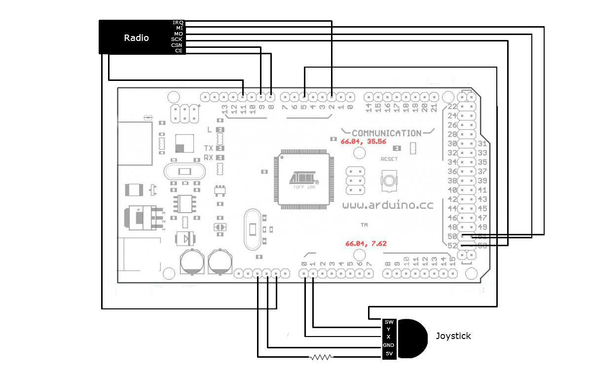

CSC 460/560: Design and Analysis of Real-Time Systems
=====================================================

Project 1 - Phase2
==================

Authors: Darren Prince and Jakob Leben

Code: https://github.com/the-lords-of-the-roombas/laser-tag

Overview
********

The goal of the second phase of project 1 was to control movement
of a Roomba robot using a joystick so as to approach a target,
aiming the Roomba so that a gun mounted on it points towards the
target and triggering the gun shot using a press of the joystick.

All control of the Roomba passed through a wireless communication link.
The task was to generate appropriate control data based on the user's
interaction with the joystick, and transmit the data accross the
wireless link. The entire system on the receiving end of the communication
was given in fully functional form.

.. raw:: html

  <iframe width="420" height="315" src="https://www.youtube.com/embed/RYjETf9D4oI" frameborder="0" allowfullscreen></iframe>

Hardware
********

The task was to assemble the following hardware components:

- Arduino Mega 2560 (http://www.arduino.cc/)
- Joystick
- Wireless radio transmitter/receiver: nRF24L01
- Voltage regulator (scaling 5V Arduino level to 3.3V wireless radio level)

Radio
-----

The voltage regulator has sockets that directly match the radio's pins,
making the two components readily pluggable together. The regulator
forwards the radio's pins to its own pins while regulating the voltage.
In the block diagram, the block labelled "Radio" refers to the composition
of these two components.

The radio has the following pins:

- MISO (Master Input, Slave Output)
- MOSI (Master Output, Slave Input)
- SCK (SPI Clock)
- CSN (Chip Select N)
- CE (Chip Enable)
- IRQ (Interrupt Request)
- Vcc (Power)
- GND (Ground)

The radio uses the Serial Peripheral Interface (SPI) for wired integration
into the host system.
In our configuraiton, Arduino acts as the SPI master.
The MISO, MOSI and SCK pins involved in the SPI communication must be
connected to the Arduino's dedicated SPI pins, as shown in the diagram.
The CSN and CE pins are controlled by software and
could be connected to arbitrary digital pins of Arduino.
The IRQ pin could be connected to any Arduino
digital pin that can produce an interrupt.
However, the radio driver that was provided to us expected the pins to be
connected as shown in the diagram.
The Vcc pin was connected to the Arduino digital pin 11 so that the radio
could be powered off and on by the software. This was required to properly
initiate communication with the radio.

Joystick
--------

The joystick has the following pins:

- X (voltage modulated by x-axis tilt)
- Y (voltage modulated by y-axis tils)
- SW (current switched by downward push)
- +5V
- GND

The X and Y pins were connected to Arduino analog inputs, and the SW
pin was connected to an Arduino digital pin, as shown in the diagram.
A resistor was placed along the power pin connection to act as the pull-up
resistor for operation of the joystick switch.

Software
********

Radio Configuration
-------------------

The program begins by initializing hardware peripherals. Specifically, the
SPI communication with the transmitter in our system has to be configured,
and the wireless link to the receiver on the Roomba had to be established.

We used a driver for our radio obtained from
`here <http://code.google.com/p/nrf24l01/>`_
and documented
`here <http://nrqm.ca/nrf24l01/driver/>`_.

Our program begins by powering the radio off and on. This is achieved by setting
the Arduino digital pin that provides power to the radio first to LOW and then
HIGH. A reboot of the radio ensures proper initialization in case the program is
restarted without the entire system having been powered down.

::

  pinMode(11, OUTPUT);

  digitalWrite(11, LOW);
  delay(100);
  digitalWrite(11, HIGH);
  delay(100);

Next, the radio is configured with the desired transmission channel, our
system's address, and the transmission destination address. The transmission
channel between communicating parties must match, and was set to the channel
on which the Roomba system operated. Each communicating party must
have a unique address for the communication to operate without conflict,
hence we chose a random address for our system, most likely being unique.

::

  // configure the communication channel
  Radio_Init(tx_channel);
  // configure receive settings for radio pipe 0
  Radio_Configure_Rx(RADIO_PIPE_0, my_addr, ENABLE);
  // configure transceiver settings
  Radio_Configure(RADIO_2MBPS, RADIO_HIGHEST_POWER);
  // set destination address
  Radio_Set_Tx_Addr(tx_address);

Note that the radio driver was modified with the addition of the communication
channel parameter to ``Radio_Init``.

Time-Triggered Tasks
--------------------

We used the Time-Triggered Architecture; the operation of the system is
broken down into the folowing tasks:

1. Sampling data from the joystick
2. Transmitting robot movement control data
3. Transmitting gun triggering data

Timing
......

The timing requirements in this phase of the project are much more relaxed
than in the first phase: the constancy of time difference between task executions
is never a critical aspect. The tasks only need to run often enough to provide
satisfactory precision of control in the time-domain.
We estimated the period of 50ms to be suitable for all tasks.

Moreover, the
tasks were all scheduled with no delay, because delayed onset of one task
by the other is of little importance. Besides, our scheduler ensures that
the order of tasks scheduled at the same time is always the same, allowing
deterministic communication between the tasks.

Communication
.............

Based on our experience from phase 1, there is a trade-off between beneficial
isolation of tasks (separation of concerns, modularity), and difficulty of
communication between the tasks. We decided to address this by having one
single large struct grouping all system state variables and accessible to
all tasks. However, to provide some logical separation, the variables
are further grouped by sub-structs related to each task::

  struct state
  {
    struct
    {
      int x; // [-100, 100]
      int y; // [-100, 100]
      bool pressed;
    } joystick;

    struct
    {
      int16_t speed;
      int16_t radius;
    } drive;

    struct
    {
      bool joystick_was_pressed;
    } shoot;

    radiopacket_t tx_packet;
  };

Due to a simplified control scheme (as described below), we ended up
not using the state variables in the ``drive`` and ``shoot`` structs.

Sampling Joystick Input
-----------------------

This task is fairly simple:

1. Reads analog and digital Arduino inputs.
2. Maps input values to desired ranges. Due to the pull-up resistor, the
   range of analog inputs was [0,350], which was mapped to [-100,100].
   The digital input reads LOW on joystick press, which was negated to
   produce boolean "true".
3. Mapped values are stored into system state variables.

Driving the Robot
-----------------

The protocol for wireless communcation with the control system installed on the
Roomba specifies a packet format that contains data that is passed through
unmodified to the Roomba through the Roomba Serial Command Interface (SCI).
The goal was
to transmit the SCI command named "Drive" with opcode 137 containing 4
data bytes describing desired velocity and radius of movement.

Initially we planned to have a sophisticated control scheme where displacement
of the joystick along one axis would provide control over velocity, and
displacement along the other axis would control the radius.

However, we met issues with wireless communication, probably due to broken
hardware (as described in the "Issues" section below), which resulted in a high
rate of packets not being transmitted. This drastically reduced the precision
of control. For this reason we devised a much simpler and robust control scheme.
Displacement of joystick along one axis only initiates movement at constant
speed in a straight line forward or backward (depending on the displacement
direction). Displacement along the other axis causes the robot to spin on the
spot clockwise or counter-clockwise (depending on the displacement direction).
The spinning and travelling actions are exclusive.

The scheduler task related to driving the robot performes the following
subtasks:

1. Reads the joystick state variables.
2. Computes the velocity and radius data for the Roomba "Drive" command.
3. Fills the communication packet data structure with appropriate data and
   transmits it.

Triggering the Gun
------------------

Another packet specified in the wireless communcation protocol with the
Roomba system is used to trigger the gun installed on the Roomba. The gun
subsystem, and the target system are the same as in the phase 1 of the project.
The packet included the particular byte of data to be transmitted by the gun
as IR emission modulation.

In our initial design, the gun would only be triggered once when the
joystick becomes pressed. However, due to the issue of large wireless packet
loss (described in the "Issues" section below), we decided to
keep transmitting the gun trigger packet repeatedly (once per execution of
the gun-trigger task), as long as the joystick is pressed.

The scheduler task related to triggering the gun performes the following
subtasks:

1. Reads the joystick state variables.
2. If the joystick is not pressed, terminates.
3. Otherwise fills the communication packet data structure with appropriate data
   and transmits it.

Issues
******

Wireless Communication
----------------------

We met significant issues with wireless communcation with the Roomba system.
A large number of transmitted packets were not received by the other end
successfully. We found that swapping the radio for another one improved
the rate of successful transmission. Nevertheless, the rate was still
significantly below 100%, as noticable by the packet-reception indicator LEDs in
the Roomba system, as well as preceivable jitter in control.

Because this issue was affected by swapping the radio, there is a strong reason
to believe that radio malfunction was the cause. However software issues in
the receiver system have not yet been ruled out.
