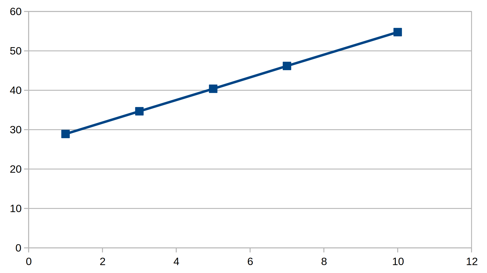
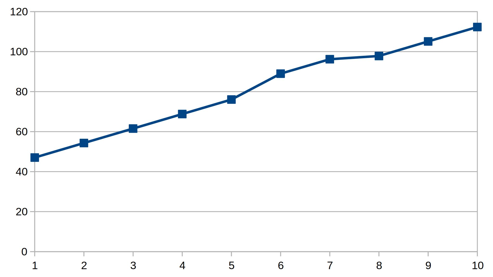

CSC 460/560: Design and Analysis of Real-Time Systems
=====================================================

Project 2
=========

Authors: Jakob Leben and Darren Prince

Code: https://github.com/the-lords-of-the-roombas/laser-tag/tree/master/project2/rtos

Overview
********

The main topic of this project is the real-time operating system (RTOS).
We were provided a specification of an RTOS application programming interface
in form of a `C header file`__ containing function declarations which we had to
implement for the Atmel ATMega2560 chip on an Arduino board.
We were also provided a `partial implementation`__ of an older
API and targeting a different Atmel chip, which we partially re-used.

.. __: https://github.com/the-lords-of-the-roombas/laser-tag/blob/master/project2/rtos_template/os.h
.. __: https://github.com/the-lords-of-the-roombas/laser-tag/tree/master/project2/rtos_template

Objectives:

1. Port provided RTOS code to the new API and the Atmel ATMega2560 chip:
    - Modify context switching code for "extended addressing" of program memory
      on Atmel ATMega2560.
    - Adjust how different error types are reported when the OS aborts.
    - Fit the task creation code to the new API: split the single task creation
      function into three: one for each task type (system, periodic,
      round-robin).

2. Add new functionality to the RTOS:
    - Implement a new periodic task scheduling mechanism.
    - Implement a function to get time in milliseconds since system start.
    - Implement simple inter-process communication ("services")

3. Test and profile the RTOS:
    - Implement a number of test programs that validate the operation of
      the RTOS.
    - Measure durations of important RTOS functions.

1. Porting provided RTOS code
*****************************

Context switching and extended addressing
-----------------------------------------

**Extended Addressing** refers to the mechanisms by which the program
memory beyond 128K bytes (64K words) is addressed. Devices with more
than 128K memory (such as the ATMega2560) have a 22 bit program counter (PC)
(as opposed to 16 bit), so that much data must be provided to instructions
that modify the PC. There is an additional register for this purpose:
the EIND (Extended Indirect Register).

Some instructions such as EIJMP (Extended Indirect Jump) compose the
new PC value by concatenating the 1-byte EIND (Extended Indirect Register)
with the 2-byte Z register. Moreover, instructions such as CALL
(Call to Subroutine)
also store the current PC as 3 bytes on the stack before modifying it,
and instructions such as RET (Return from Subroutine) pop 3 bytes off the
stack to obtain the new PC value.

This implies the following **adjustments** of the provided RTOS code:

- EIND is an additional part of the context that must be saved and restored
  when switching tasks.
- Function pointers (such as return address) take 3 bytes on stack instead of 2.

We added instructions to save the EIND (0x3C) when **saving context**
(after the original R31 has already been stored)::

    ...
    in     r31, 0x3C  ; Read EIND into R31
    push   r31        ; Push R31 to stack
    ...

We added instructions to restore the EIND (0x3C) when **restoring context**
(before the final R31 is restored)::

    ...
    pop    r31        ; Pop from stack into R31
    out    0x3C, r31  ; Write R31 into EIND
    ...

In addition, when a task is created, its **stack must be initialized**
as if it was generated by the context switching code, if we want to
use the context restoration code to begin execution of the task. This means
space for the EIND must be inserted.

Moreover, below the task context, the stack must contain two **function pointers**:

- The task function, used by the RET instruction after restoring
  the task context when switching to the task.
- The Task_Terminate function, executed in case the task function itself
  returns.

As explained above, the return addresses occupy 3 bytes on the stack.
The question is, what are these 3 bytes in relation to **function pointers
in the C language?** In C, function pointers on a 16-bit-word
machine are only 16 bits in size. C compilers solve this using the "trampoline"
mechanism: pointers to functions in program memory above 64K words are
actually 16-bit pointers into lower parts of the memory that contain
instructions that jump into the extended memory. This means that we
still need to store 3 bytes onto the stack (because that's what the RET
instruction pops), but the MSB will always be 0, and the two other
bytes are equal to the C function pointer.

The stack of a newly created or a suspended task therefore looks like this:

===========  ===== ===============================
Description  Byte  Contents
===========  ===== ===============================
TOP          0
             1     "R0"
                   .
                   .
                   .
             31    "R30"
             32    "EIND"
             33    "SREG"
             34    "R31"
             35    0x0
             36    "Task Function Pointer (MSB)"
             37    "Task Function Pointer (LSB)"
             38    0x0
             39    "Task_Terminate Function Pointer (MSB)"
BOTTOM       40    "Task_Terminate Function Pointer (LSB)"
===========  ===== ===============================

Reporting errors
----------------

This is the set of errors possibly reported when the OS aborts:

  1. ERR_USER_CALLED_OS_ABORT: OS_Abort() called by application code.
  2. ERR_PERIODIC_SCHEDULE_SETUP: Periodic task created after periodic
     schedule start, or schedule start requested multiple times.
  3. ERR_PERIODIC_SCHEDULE_RUN: One of the periodic schedule faults:
      - A task overlaps with another task, as declared in the schedule.
      - A running task exceeds its declared worst-case execution time.
      - A running task is preempted long enough to not yield before the
        onset of another task.
  4. ERR_SERVICE_SUBSCRIBE: Periodic task requested subscription to service.
  5. ERR_RTOS_INTERNAL_ERROR: Should not be caused by any application code,
     but indicates internal violation of assumptions.

The ``OS_Abort`` function never returns; it repeatedly executes code that
signals the error. The **error is signalled** by flashing the built-in LED on
Arduino: first for a longer time (about 2 seconds), and then briefly as
many times as the error number.

More about errors related to periodic tasks is written in a following section.

Task creation
-------------

There are three task creation methods: one for each task type (system, periodic,
round-robin)::

  int8_t   Task_Create_System(void(*f)(void), int16_t arg);

  int8_t   Task_Create_RR(void(*f)(void), int16_t arg);

  int8_t   Task_Create_Periodic(void (*f)(void), int16_t arg,
                                uint16_t period, uint16_t wcet, uint16_t start);

All three pass their parameters to the OS kernel using the same global
data structure ``create_args_t``, and are stored in the structure
``task_descriptor_t`` that represents tasks of all types.
The additional arguments of
``Task_Create_Periodic`` are simply ignored in behavior of the other two task
types.

2. New functionality
********************

Periodic task scheduling
------------------------

A periodic task is created using the following function::

    int8_t Task_Create_Periodic(void (*f)(void), int16_t arg,
                                uint16_t period, uint16_t wcet, uint16_t start);

The specified **semantics** require a task to be created that:

- Starts executing at ``start`` ticks after OS start.
- The time when it is resumed after yielding
  using ``Task_Next`` is delayed until ``period`` ticks after the last onset.
- It may only run for ``wcet`` ticks at once before yielding;
  ``wcet`` must be smaller than ``period``.

The new periodic task creation interface seems to suggest that a periodic
task can be created at any time during the operation of the system.
However, the specified **starting time** of the task might have **already passed**
at the time of creation. This leaves the user with some mental effort
to compute the actual time the task will first run, as if the
task had started at the specified time in the past. We find that quite
error-prone, possibly resulting in inconsistent schedules (overlapping tasks).

Instead, we decided to **add another function** to the API::

    void Task_Periodic_Start();

When this function is called, it designates that the **periodic schedule
as a whole begins** at the next system clock tick. The start time of
periodic tasks created earlier will be relative to the schedule onset.
Periodic task creation is not allowed after calling this function, and the OS
will abort with ``ERR_PERIODIC_SCHEDULE_SETUP`` if this is attempted.

Periodic scheduling decisions are very **efficient**. Each task's next onset time is
stored into a variable in its ``task_descriptor_t`` and incremented by its
period at every onset (O(1)). When a task is created, it is placed into a linked
list (O(1)) with next onset time initialized to its start time. At the start of
the schedule, the kernel finds and remembers the earliest onset of a
task (O(N)). At the onset, the task is marked ready for running and the next
earliest onset time is found and remembered (O(N)). This way, in between task
onsets, the scheduler needs only to compare the current time to the remembered
onset time (O(1)). Finding the earliest next onset could be made more efficient
using a min-heap (O(log(N))) instead of a list, but the benefits within the
limit of 8 tasks hardly justify such implementation. This scheme has
no trouble with time overflow, as times are always compared for exact equality.

Specification requires the OS to abort when a task exceeds its **worst-case
execution time** (WCET). However, the allowed running time should be extended
when the task is preempted. We solved this efficiently by counting system clock
ticks while a task is actually running (not preempted), and comparing that
to the WCET.

The system will **abort** with ``ERR_PERIODIC_SCHEDULE_RUN`` when one of the
following conditions occurs:

- A task actually runs longer than its WCET.
- A task is preempted for so long as to run over the next task onset.
- At onset of a task, it is found that the current time plus its WCET would
  run over the next task onset.

All these conditions are **critical** in the sense that they result in an
overlap of periodic tasks, which could only be resolved by one of the following
drastic measures:

- Immediately kill the currently running offending task
  (for good - there is no way to know where in code to resume it).
- Skip future overlapping task occurences.
- Postpone future overlapping task occurences, possibly affecting the entire
  future schedule.

None of the above seems like the obvious right thing to do, so it is better to
just abort the entire system.

Elapsed time
------------

The OS must return the elapsed time in milliseconds since system start
by the following function::

    uint16_t Now()

A simple solution would be to return the number of system clock ticks times
the duration of a tick, but that would obviously limit the resolution.

A better but still economic solution uses the same hardware timer used by the
system clock: it converts the timer counter value since the
last system clock tick to milliseconds and adds that to the current system
clock tick converted to milliseconds.
This way, we retain the precision of the underlying timer counter
(1/8 of CPU clock frequency), with maximum resolution (1 ms).

Inter-process communication (services)
--------------------------------------

The Service API consists of the following functions::

    SERVICE *Service_Init();

    void Service_Subscribe( SERVICE *s, int16_t *v )

    void Service_Publish( SERVICE *s, int16_t v )

The specified **semantics** require that ``Service_Subscribe`` suspends the
calling task (*subscriber*) until another task (*publisher*) calls
``Service_Publish`` on the same ``SERVICE``. At that point, the value ``v`` is
transferred to the locations ``*v`` of each subscriber. Moreover, each
subscriber becomes ready for execution.

In our implementation, each service is represented by the following structure::

    struct service
    {
        queue_t subscribers;
        volatile int16_t value;
    };

To avoid dynamic memory allocation, an array of such data structures is
**pre-allocated**, limiting the maximum number of services.

By storing a **queue of subscribed tasks** in each service we allow seamless
moving of system and round-robin tasks from their ready queues to the
queue of a service on which they are waiting, and back.

This also provides efficiency:

- ``Service_Subscribe`` is in O(1).
- ``Service_Publish`` is in O(N) where N is the number of only subscribed tasks.

When **subscribing**, the current task is simply enqueued in the service queue,
ensuring it will not be selected at next task dispatch.
When the task is resumed, the service value is copied to the destination
address provided to ``Service_Subscribe``.

When **publishing**, the provided value is copied into the service structure.
The kernel then moves all subscribers to their respective ready queues
depending on type (system or round-robin). Finally, the publisher
**yields**: it's state goes from "running" to "ready", and it is placed last in
its ready queue if not a periodic task. The common dispatch mechanism will then
select the highest-priority front-of-queue ready task, which might still be the
publisher itself or another task.

The decision that **publishing always yields**, regardless of the publisher's
priority level, is supported by the following reasoning. Lower priority tasks
must obviously yield to higher priority tasks, but at the point of publishing it
is not obvious to the user whether there exists a subscriber of higher priority
than the publisher. To avoid uncertainty, we decided that
periodic and round-robin publishers always yield. For consistency, we
then applied the same rule to system publishers.

3. Testing and profiling
************************

We decided to trace and profile testing code by using a logic analyzer
to record state of digital output pins manipulated by the kernel code
and the test code.

We inserted optionally-compiled code into the kernel that assigns a
digital output pin to each task, and switches it high when the task is
selected to run, and low when a different task is selected. Each task is
assigned an Arduino digital pin designated by the task's creation argument.
This way test code can decide assignment of pins.

We decided to use the pins 2 to 7 for the purpose of kernel tracing.
A task is assigned a pin number equal to its creation argument plus 2. The
idle task is created with argument 0, and the main task is created with
argument 1, so the first two pins in the range are reserved for these two
tasks.

The logic analyzer has only 8 channels, so we had to compromise with
what we can trace. We decided to use 4 channels (0-3) to trace kernel
task-switching (ignoring the idle and the main task), and the other 4
channels (4-7) for test-specific tracing with output on Arduino pins 8-11.

This is the overview of the mapping:

======================  ===================   ======================
Task Creation Argument  Arduino Digital Pin   Logic Analyzer Channel
======================  ===================   ======================
0 (Idle)                2
1 (Main)                3
2                       4                     0
3                       5                     1
4                       6                     2
5                       7                     3
                        8                     4
                        9                     5
                        10                    6
                        11                    7
======================  ===================   =======================

What follows are descriptions of each test,
with links to code and trace plots.

Main
----

- `Code <https://github.com/the-lords-of-the-roombas/laser-tag/blob/master/project2/rtos/test/test_main.cpp>`__
- `Trace <traces/trace-main.png>`__

This is the basic sanity test confirming that the application's main function
``r_main`` is called at system startup as the main task.

The main function switches the trace channel 4 between high and low every 5 ms.

System task creation
--------------------

- `Code <https://github.com/the-lords-of-the-roombas/laser-tag/blob/master/project2/rtos/test/test_system_create.cpp>`__
- `Trace <traces/trace-system-create.png>`__

The main task works for 1 ms, creates another system task, works for 1 ms more,
and then terminates. The created task does exactly the same. Thus, an infinite
chain of tasks is created where each one creates the next one.

System tasks should not be pre-empted when they create other system tasks,
so every task should complete its 2 ms work before the next task runs.
This is visible in the task-trace channels. Each next task is
assigned a task-trace channel equal to task number % 4.

Moreover, each task switches the trace channel 4 high just before creating
another task, and low just after that. Thus, we can measure the time it
takes to create a task. The average of 6 measurements is 48.3 us.

System tasks yielding to each other
-----------------------------------

- `Code <https://github.com/the-lords-of-the-roombas/laser-tag/blob/master/project2/rtos/test/test_system_yield.cpp>`__
- `Trace <traces/trace-system-yield.png>`__

The main task creates 3 system tasks. Each one indicates its operation by
switching a trace channel high, working for some time, and switching it back
low; each one operates on a different trace channel (4, 5, or 6) and
does a different amount of work (1, 2, or 3 ms), which allows identification
of the tasks.

After doing some work, a task switches the trace channel 7 high, yields,
and then switches the channel back low. Because a different task starts
running as soon as one yields, the trace channel will be switched high by
the yielding task and then low by the task that gets to run next. We can
thus measures the task switching time between consecutive rising and falling
edges of the trace channel 7.
The average of 6 measurements is 38.92 microseconds.

Periodic task creation
----------------------

- `Code <https://github.com/the-lords-of-the-roombas/laser-tag/blob/master/project2/rtos/test/test_periodic_create.cpp>`__
- `Trace <traces/trace-periodic-create.png>`__

This simple test just confirms that a periodic task is created, started
at the specified time and run at a specified interval.

The main task creates one periodic task.
Before starting the periodic schedule, the main task works for 8 ms.
The periodic schedule starts at the next tick, which is at 10 ms.

The periodic task starts at 0 ticks, it has a period of 1 tick and WCET of
1 tick. It keeps the trace channel 5 high while running. It works for
1 ms before yielding, which is within its WCET.

Moreover, the main task swithes the trace channel 4
high just before and low just after the periodic task creation,
allowing to measure the task creation time. One measurement gave 48.584
microseconds, which is not significantly different from the system task
creation. This is expected, as the code path is very similar.

Periodic task scheduling
------------------------

- `Code <https://github.com/the-lords-of-the-roombas/laser-tag/blob/master/project2/rtos/test/test_periodic_schedule.cpp>`__
- `Trace <traces/trace-periodic-schedule.png>`__

The main task creates 3 periodic tasks:

  1. Start = 0 ticks, Period = 2 ticks, WCET = 1 tick
  2. Start = 1 ticks, Period = 4 ticks, WCET = 1 tick
  3. Start = 3 ticks, Period = 4 ticks, WCET = 1 tick

It then works for 4 ms before starting the periodic schedule. The schedule
will thus start at the next tick, which is at 5 ms.

Each periodic task keeps a different trace channel high while running (channel
4, 5, or 6), and works for 1 ms before yielding. This verifies that the task
code actually runs. It also allows to measure when a task first runs,
and the time difference between two onsets of a task.
The measured onset times correspond to the requested periodic schedule.

Invalid periodic schedule
-------------------------

- `Code <https://github.com/the-lords-of-the-roombas/laser-tag/blob/master/project2/rtos/test/test_periodic_schedule_overlap.cpp>`__
- `Trace <traces/trace-periodic-schedule-overlap.png>`__

This test confirms that the OS aborts when trying to run an invalid periodic
task schedule.

The main function creates three periodic tasks:

  1. Start = 0 ticks, Period = 2 ticks, WCET = 1 tick
  2. Start = 1 ticks, Period = 4 ticks, WCET = 3 tick
  3. Start = 3 ticks, Period = 4 ticks, WCET = 1 tick

The second task has WCET 3 ticks, which makes it overlap with the first task.
For example, first execution of the second task starts at 1 tick and may
run until 1 + 3 = 4th tick. However, the second execution of the first task
starts at 2 ticks.

The OS aborts at the moment the offending task (the second task) is about to
run, which is at 1 tick. Since the periodic schedule starts at 10 ms, the
OS aborts at 15 ms.

Periodic task takes too long
----------------------------

- `Code <https://github.com/the-lords-of-the-roombas/laser-tag/blob/master/project2/rtos/test/test_periodic_task_timeout.cpp>`__
- `Trace <traces/trace-periodic-task-timeout.png>`__

This test confirms that the OS aborts when a task does not yield within
its WCET.

The main task creates 2 periodic tasks:

  1. Start = 0 ticks, Period = 5 ticks, WCET = 1 tick
  2. Start = 1 ticks, Period = 5 ticks, WCET = 1 tick

The second task never yields. The OS aborts at the moment when the offending
task first reaches its WCET, which is at 2 ticks. Because the periodic
schedule starts at 10 ms, the OS aborts at 20 ms.

Periodic task preemption
------------------------

- `Code <https://github.com/the-lords-of-the-roombas/laser-tag/blob/master/project2/rtos/test/test_periodic_preempt.cpp>`__
- `Trace <traces/trace-periodic-preempt.png>`__

This test confirms:

  - System tasks preempt periodic tasks.
  - Allowed running time of periodic tasks is extended beyond their WCET
    by the duration that they are being preempted.
  - None of this affects inter-onset time of periodic tasks.

The main task creates a periodic task which starts at 1 tick, has a period
of 5 ticks and WCET of 1 tick.

The periodic task repeatedly creates a
system task and then yields. It sets the trace channel 4 high just
before creation of the system task and low just after that.

The system
task sets the trace channel 5 high, works for 10 ms (2 ticks), sets the trace
channel low, and then terminates.

By observing the trace channels 4 and 5, we deduce that the periodic task is
preempted by the system task as soon as the system task is created, and the
system task runs to completion before the periodic task resumes. This means
that it will take at least 10 ms (2 ticks) before the periodic task yields,
which is longer than its WCET (1 tick). However, the OS does not abort, which
means the allowed runnning time of the periodic task is successfully extended
beyond its WCET while it is being preempted.

The trace also confirms that the inter-onset time of the periodic task is
unaffected (5 ticks = 25 ms).

Periodic task preemption too long
---------------------------------

- `Code <https://github.com/the-lords-of-the-roombas/laser-tag/blob/master/project2/rtos/test/test_periodic_preempt_timeout.cpp>`__
- `Trace <traces/trace-periodic-preempt-timeout.png>`__

This test confirms that the OS aborts when preemption of a periodic task
extends its running time beyond the next onset of a periodic task.

The main task creates 2 periodic tasks:

  1. Start = 0 ticks, Period = 5 ticks, WCET = 1 tick
  2. Start = 1 ticks, Period = 5 ticks, WCET = 1 tick

The first periodic task creates a system task which preempts it for longer
than its WCET, thus running over the onset of the second task. The OS
aborts when the second task is first about to run - that is at 1 tick
plus the 5 ms offset of the periodic schedule start = 10 ms.

Periodic Task Selection Time
----------------------------

- `Code <https://github.com/the-lords-of-the-roombas/laser-tag/blob/master/project2/rtos/test/test_periodic_select_time.cpp>`__

This test is designed for measurement of next earliest periodic task
selection time, in relation to the number of periodic tasks.
The task selection time is an O(N) algorithm, where N is the number of
periodic tasks. Hence, we expect a linear time increase with the number
of tasks.

The main task creates **n** number of periodic tasks, each with the same
period, but offset by 1 tick in relation to the previous one.

To measure the task selection time, the tracing output had to be adjusted
in comparison to other tests. The OS kernel was modified to set a trace
channel high whenever exiting from the kernel into a task, and low when
entering from a task. The mapping between task creation arguments and
Arduino pins remained the same. However, we adjusted the mapping of Arduino
pins to trace channels, so that we had the idle task on channel 0 and the
task with argument 2 on channel 1. We measured the time between entering
the kernel from the idle task (due to the system clock timer interrupt), and
exiting into a selected periodic task.

We found out that the time measurement also depends on the index of the
task within the schedule (this affects computation of the smallest of the
distances to the next occurences of each task). We decided to always
measure the case which results in the largest measured duration. We
computed the average of 5 such measurements for each case of
1, 3, 5, 7, and 10 periodic tasks. The durations in the table below
are in microseconds:

===============================================
Number of tasks:   1     3     5     7    10
================= ==    ==    ==    ==    ==
Duration (us):    28.90 34.67 40.38 46.17 54.75
===============================================

This `trace <traces/trace-periodic-select-time-10.png>`__
shows an example measurement for a run with 10 tasks.

The plot below clearly confirms a linear increase.
The increase is about **2.87 microseconds per task**.

Round-robin task creation
-------------------------

- `Code <https://github.com/the-lords-of-the-roombas/laser-tag/blob/master/project2/rtos/test/test_rr_create.cpp>`__
- `Trace <traces/trace-rr-create.png>`__

This simple test confirms that round-robin tasks are created successfully.

The main task creates a round-robin task which starts running after the
main task completes its 10 ms of work. The round-robin task switches
the trace channel 5 between high and low every 2 ms.

Moreover, the main task switches the trace channel 4 high just before
creation of the round-robin task, and low just after that, which allows
to measure the task creation time. One measurement gave 48.416 microseconds,
comparable to creation of other tasks, as expected.

Round-robin task interleaving
-----------------------------

- `Code <https://github.com/the-lords-of-the-roombas/laser-tag/blob/master/project2/rtos/test/test_rr_interleave.cpp>`__
- `Trace <traces/trace-rr-interleave.png>`__

This test confirms that round-robin tasks are interleaved in the order of
their creation, each one running for 1 tick.

The main task creates 4 round-robin tasks, works for 10 ms and then terminates,
at which point the first round-robin task runs.

Each round-robin task indicates operation by switching a different trace channel
(4, 5, 6, or 7). Repeatedly, the channel is switched between high and low
every 23 ms.

We can observe from the first 4 trace channels that tasks are indeed being
switched every single tick (5ms). Moreover, the last 4 trace channels indicate
that all the tasks progress at the same speed, completing each of their
23 ms work periods at the same time. Because they are interleaved, this
time is extended to about 4 times 23 ms = 92 ms (a bit shorter because
of different starting times).

Round-robin task preemption
---------------------------

- `Code <https://github.com/the-lords-of-the-roombas/laser-tag/blob/master/project2/rtos/test/test_rr_preempt.cpp>`__
- `Trace <traces/trace-rr-preempt.png>`__

This test confirms that round-robin tasks are preempted both by system and
periodic tasks.

The main task creates a round-robin task and a periodic task, and then
terminates.

The round-robin task repeatedly works for 20 ms and then creates a system
task, switching the trace channel 4 high and low just before and after
the system task creation.

The system task switches the trace channel 5 high, works for 1 ms, and then
switches the trace channel back low.

The periodic task runs every 1 tick (5 ms). At each run, it switches the
trace channel 6 high, works for 1 ms, and switches the trace channel back
to low.

By comparing the trace channel 0 (which shows when the periodic task is
being selected as the current kernel task) with other channels, we can
observe that the round-robin task is being preempted by both other types of
tasks.
Moreover, the trace also shows a case where an occurrence of a
system task overlaps with a scheduled occurence of the periodic task, displacing
the execution of the periodic task forwad in time. This results in an
increase of the periodic task's inter-onset time from 5 ms to 5.8 ms, and
preemption of the round-robin task for 2 ms instead of 1 ms.

System clock
------------

- `Code <https://github.com/the-lords-of-the-roombas/laser-tag/blob/master/project2/rtos/test/test_time.cpp>`__
- `Trace <traces/trace-time.png>`__

This test confirms that the system clock works correctly - that is, the
function ``Now`` returns the time in milliseconds since start of OS.

The main function repeatedly picks one of the 4 different durations (3, 6, 9,
or 12 milliseconds). Each time, it queries the OS time, works for the
desired duration, and queries the OS time again. Then it computes the
difference between the reported time measurements and works for the
computed amount of time.

The trace channel 4 is switched high just before and low just after the two
time queries, and the channel 5 is switched high just before and low just after
the work period corresponding to the measured time. This way it is possible
to measure and compare the actual measured duration with the duration
reported by the OS. The trace confirms that they match.

Note that the
slight differences are due to the unavoidable imperfection of the duration of
the ``_delay_ms`` function, the overhead of switching pins high and low
and of the called functions, and the hardware's smallest quantum of time - the
duration of a single CPU cycle.

Services: communication between system tasks
--------------------------------------------

- `Code <https://github.com/the-lords-of-the-roombas/laser-tag/blob/master/project2/rtos/test/test_service_system_to_system.cpp>`__
- `Trace <traces/trace-service-system-to-system.png>`__

This test confirms the basic operation of services: one system task
publishes over a service to another system task.

The main task creates a service and a system task that will publish over
the service.
The publisher repeatedly picks a number between 5 and 1 and publishes it
over the service. The main task repeatedly subscribes to the service and then
works for as many milliseconds as the number received over the service.
The main task sets the trace channel 5 high just before the work and low just
after that. Measuring the work times confirms that the correct values are passed
over the service.

Moreover, the publisher sets the trace channel 4 high just before publishing,
and the main task sets it low just after subscribing. This way we can measure
the time it takes to switch from the publisher to the subscriber. Three
measurements gave an average of 47.66 microseconds.

Services: periodic task to system task
--------------------------------------

- `Code <https://github.com/the-lords-of-the-roombas/laser-tag/blob/master/project2/rtos/test/test_service_periodic_to_system.cpp>`__
- `Trace <traces/trace-service-periodic-to-system.png>`__

This test confirms that communication over a service from a periodic to
a system task works, and that the periodic task is preempted as soon as
it publishes.

The main task creates a service and a periodic task with a 1 tick period.
In each period, the periodic task publishes to the service and then works
for 1 ms. It sets the trace channel 5 high before publishing and low after
the end of work. Moreover, it sets the trace channel 4 high before publishing.
The main task repeatedly subscribes to the service and then sets the trace
channel 4 to low.

The trace confirms the assumption that the system task preempts the
periodic task as soon as the latter publishes while the former is subscribed
(the trace channel 4 becomes low before the channel 5).

Moreover, the duration
that the trace channel stays high is the time it takes to switch between the
tasks. The average of 8 measurements is 45.54 microseconds.

Service: round-robin task to system task
----------------------------------------

- `Code <https://github.com/the-lords-of-the-roombas/laser-tag/blob/master/project2/rtos/test/test_service_rr_to_system.cpp>`__
- `Trace <traces/trace-service-rr-to-system.png>`__

This test is very similar to the one above. The trace confirms preemption
of the round-robin task by the system task as soon as the former publishes
when the latter is subscribed. The average task switching time of 6
measurements is 47.23 microseconds, comparable to the other two.

Service: interrupt to system task
---------------------------------

- `Code <https://github.com/the-lords-of-the-roombas/laser-tag/blob/master/project2/rtos/test/test_service_isr_to_system.cpp>`__
- `Trace <traces/trace-service-isr-to-system.png>`__

This test confirm success of communication over a service between an
interrupt service routine (ISR) and a system task.

The main task creates a service and sets up a hardware timer to trigger
an interrupt every 10 ms. The ISR publishes over the service one value
between 1 and 5. The main task repeatedly subscribes to the service and
the works for as many milliseconds as the value received over the service.

The trace channel 4 confirms the desired period between interrupts.
The trace channel 5 confirms that the value is transmitted successfully.

Service: interrupt to round-robin task
--------------------------------------

- `Code <https://github.com/the-lords-of-the-roombas/laser-tag/blob/master/project2/rtos/test/test_service_isr_to_rr.cpp>`__
- `Trace <traces/trace-service-isr-to-rr.png>`__

This test is very similar to the one above. Visual inspection of the code
and the trace confirms correct operation. No difference from the above
test is neither expected, nor observed.

Service: invalid subscription from periodic task
------------------------------------------------

- `Code <https://github.com/the-lords-of-the-roombas/laser-tag/blob/master/project2/rtos/test/test_service_to_periodic.cpp>`__
- `Trace <traces/trace-service-to-periodic.png>`__

According to the specification for the RTOS, it is not allowed for a
periodic task to subscribe to a service, and the OS should abort in this
case.

In this test, the main function creates a periodic task that starts at
3 ticks plus the time before the start of schedule (1 tick), which is in
total 4 ticks (20 ms). The trace confirms that the OS aborts at that time.

Service: bi-directional communication using two services
--------------------------------------------------------

- `Code <https://github.com/the-lords-of-the-roombas/laser-tag/blob/master/project2/rtos/test/test_service_ping_pong.cpp>`__
- `Trace <traces/trace-service-ping-pong.png>`__

This test confirms that two system tasks can communicate back and forth
using two services.

The main task creates two services and two other system tasks. Each
task repeatedly publishes on one service and subscribes to the other.
Publishing makes the publisher yield to the subscriber, which in turn proceeds
to publish over another channel. In order to ensure that one task is indeed
subscribed to the service to which the other one publishes, each task yields
additionally before publishing.

In addition, after subscribing, each task works for as many milliseconds as the
value it receives over a service, increments that value and wraps it to
the range of 1 to 5, and publishes the result over the other service.
The amount of time each task works is indicated on the trace channels 4 and 5,
respectively. The trace confirms correct passing of values over the services.

Service: unicast
----------------

- `Code <https://github.com/the-lords-of-the-roombas/laser-tag/blob/master/project2/rtos/test/test_service_unicast.cpp>`__
- `Trace <traces/trace-service-unicast.png>`__

This test verifies one-to-many communication over multiple services, one
for each pair of communicating tasks.

The main task creates 3 services and three other system tasks. Each
task repeatedly subscribes to one of the services, and then works for
as many milliseconds as the value received over the service. The main task
repeatedly publishes a different value (1, 2, or 3) to each of the services.
To ensure that all subscribers are indeed subscribed at the time of publishing,
it yields before publishing.

Each subscriber keeps one of the trace channels 5, 6, and 7 high as long
as it is running. Moreover, the main task keeps the trace channel 4 high while
publishing to the three services. The trace indicates correct transmission
of values over the services, and expected order of execution of tasks
(the subscribers run in the order of publishing to their respective services).

Service: broadcast
------------------

- `Code <https://github.com/the-lords-of-the-roombas/laser-tag/blob/master/project2/rtos/test/test_service_broadcast.cpp>`__
- `Trace <traces/trace-service-broadcast.png>`__

This test verifies one-to-many communication over a single service.

The main task creates 1 service and three other system tasks. Each
task repeatedly subscribes to the single service, and then works for
as many milliseconds as the value received over the service. The main task
repeatedly publishes a different value (1, 2, or 3) to the service.
To ensure that all subscribers are indeed subscribed at the time of publishing,
it yields before publishing.

Each subscriber keeps one of the trace channels 5, 6, and 7 high as long
as it is running. Moreover, the main task keeps the trace channel 4 high while
publishing to the service. The trace indicates correct transmission
of values over the services, and expected order of execution of tasks.
The subscribers run in the order of their subscription, which is the same
as the order of their creation, due to their execution order when the main
task first yields.

Service: publish time
---------------------

- `Code <https://github.com/the-lords-of-the-roombas/laser-tag/blob/master/project2/rtos/test/test_service_publish_time.cpp>`__
- `Trace <traces/trace-service-publish-time.png>`__

This test is designed for measurement of the time spent in kernel
when calling ``Service_Publish``, until the first subscriber runs.
Waking up all subscribers is obviously an O(N) algorithm, where N is
the number of subscribers. Hence, we expect a linear time increase with the
number of subscribers.

The main task creates a service, and a system task which subscribes to
the service. It then brings the trace channel 8 high and publishes to the
service. The subscriber brings the trace channel 8 low immediately after
subscribing. This is repeated 5 times.
The main task than adds another subscribing task, and repeats the whole
procedure, until having published 5 times to 10 subscribers.
The trace shows the first couple of repetitions (for 1 to 4 subscribers).

We measured the amount of time the trace channel 8 is high, resulting in
5 measurements for each number of subscribers, which were averaged to
produce the following data (the durations are in microseconds):

======================================================================================
Number of subscribers: 1      2     3     4    5      6     7     8     9       10
====================== =      =     =     =    =      =     =     =     =       =
Duration (us):         47.03  54.30 61.53 68.80 76.05 88.99 96.21 97.81 105.10  112.30
======================================================================================

The plot below clearly confirms a linear increase.
The increase is about **7.25 microseconds per task**.

Conclusion
**********

The provided RTOS code has been successfully **adjusted for Extended Addressing**
of ATMega2560 program memory above 128K bytes.

The new **task creation interface** has been succesfully implemented.

A new **periodic scheduling** mechanism has been implemented **efficiently**,
with the worst running time of any operation in O(N), and only with the use of
simple mathematical operations such as addition and comparison for equality.
The mechanism is not hindered at all by **system clock overflow**. We proposed and
implemented an additional function that defines the **periodic schedule start**
time, improving intelligibility, robustness and maintainability of application
code. **Critical conditions** related to periodic scheduling were identified and
handled by aborting the system and reporting appropriate errors.

The **service API** has been implemented successfully and **efficiently**, with
the worst running time of any operation in O(S), where S is
the number of subscribers to a service. **Preemption** of publishers by
higher-priority subscribers has been ensured, and attention has been paid
to **predictabile behavior** with regard to yielding of publishers to other
tasks of equal or higher priorty.

The **system clock API** that reports milliseconds since system start has been
implemented with high **precision** (1/8 of the CPU clock frequency)
and maximum **resolution** (1 ms).

The behavior of the RTOS has been extensively **tested and profiled** by tracing
the operation of a large number of test applications. All tests confirmed
**correct behavior**.

The following **time measurements** are of interest:

- Average task creation time: ~ 48.5 microseconds.
- Average task-switching time by yielding: ~ 39 microseconds.
- Average task-switching time between a service publisher and a subscriber:
  ~ 47 microseconds.
- Periodic task selection time: ~ 2.9 microseconds times the number of periodic tasks.
- Service publishing time: ~ 7.3 microseconds times the number of subscribers.

We can estimate from this that the base time required to switch context into and
out of the kernel is somewhere below 40 microseconds. The operations in O(1),
such as task creation and yielding will never take much more than this time.
Other operations in O(N) like selecting the next periodic task to run, or
publishing over a service, have a linear time increase in dependence on the
number of tasks involved. The time spent in the kernel is important because it
is the maximum time that the system does not respond to interrupts.
